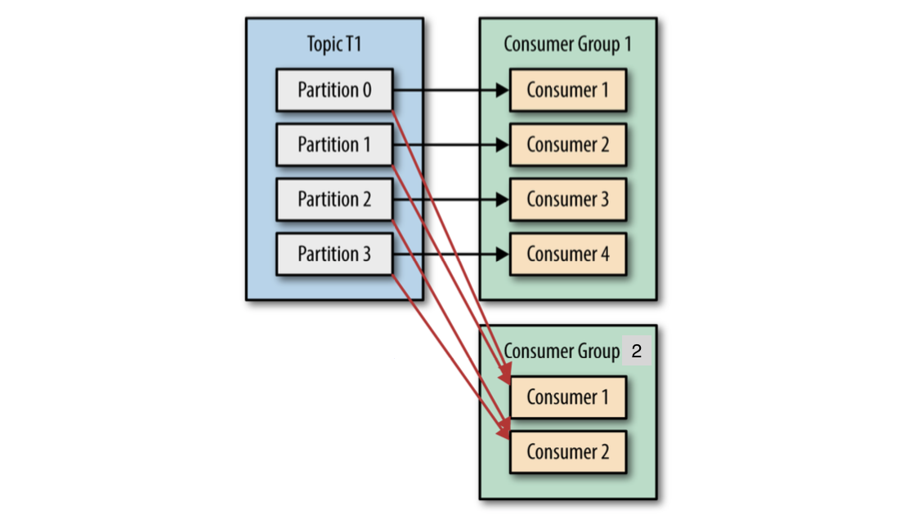

# Consumer

- Subscribes to topics and receives message
- Consumer Group -> method of scaling consumption

  - Membership triggered by a `JoinGroup` call
  - First member is the de-facto group leader
  - leader assigns partitions to consumers in the consumer group
  - Membership is maintained by sending _heartbeats_ at intervals regularly to the _group coordinator_
  - Sent during `poll` and `commit`
  - missing heartbeats for a period will trigger rebalance as the consumer is thought to be dead

- _Rebalance_ moving partition ownership from one consumer to another
  - high scalability and availability
  - creates a short unavailability window



# Creating a Consumer

## In [[rust]]

Crate : [kafka](https://crates.io/crates/kafka)

```Rust
use kafka::consumer::{Consumer, FetchOffset, GroupOffsetStorage};
let mut consumer =
   Consumer::from_hosts(vec!("localhost:9092".to_owned()))
      .with_topic_partitions("my-topic".to_owned(), &[0, 1])
      .with_fallback_offset(FetchOffset::Earliest)
      .with_group("my-group".to_owned())
      .with_offset_storage(GroupOffsetStorage::Kafka)
      .create()
      .unwrap();
loop {
  for ms in consumer.poll().unwrap().iter() {
    for m in ms.messages() {
      println!("{:?}", m);
    }
    consumer.consume_messageset(ms);
  }
  consumer.commit_consumed().unwrap();
}
```

Crate : [rdkafka](https://crates.io/crates/rdkafka)

```Rust
async fn consume(brokers: &str, group_id: &str, topics: &[&str]) {
    let context = CustomContext;

    let consumer: LoggingConsumer = ClientConfig::new()
        .set("group.id", group_id)
        .set("bootstrap.servers", brokers)
        .set("enable.partition.eof", "false")
        .set("session.timeout.ms", "6000")
        .set("enable.auto.commit", "true")
        //.set("statistics.interval.ms", "30000")
        //.set("auto.offset.reset", "smallest")
        .set_log_level(RDKafkaLogLevel::Debug)
        .create_with_context(context)
        .expect("Consumer creation failed");

    consumer
        .subscribe(&topics.to_vec())
        .expect("Can't subscribe to specified topics");

    // consumer.start() returns a stream. The stream can be used ot chain together expensive steps,
    // such as complex computations on a thread pool or asynchronous IO.
    let mut message_stream = consumer.start();

    while let Some(message) = message_stream.next().await {
        match message {
            Err(e) => warn!("Kafka error: {}", e),
            Ok(m) => {
                let payload = match m.payload_view::<str>() {
                    None => "",
                    Some(Ok(s)) => s,
                    Some(Err(e)) => {
                        warn!("Error while deserializing message payload: {:?}", e);
                        ""
                    }
                };
                info!("key: '{:?}', payload: '{}', topic: {}, partition: {}, offset: {}, timestamp: {:?}",
                      m.key(), payload, m.topic(), m.partition(), m.offset(), m.timestamp());
                if let Some(headers) = m.headers() {
                    for i in 0..headers.count() {
                        let header = headers.get(i).unwrap();
                        info!("  Header {:#?}: {:?}", header.0, header.1);
                    }
                }
                consumer.commit_message(&m, CommitMode::Async).unwrap();
            }
        };
    }
}
```

---

## In [[golang]]

Package : [Confluent Inc](https://github.com/confluentinc/confluent-kafka-go)

```golang
func main() {

	c, err := kafka.NewConsumer(&kafka.ConfigMap{
		"bootstrap.servers": "localhost",
		"group.id":          "myGroup",
		"auto.offset.reset": "earliest",
	})

	if err != nil {
		panic(err)
	}

	c.SubscribeTopics([]string{"myTopic", "^aRegex.*[Tt]opic"}, nil)

	for {
		msg, err := c.ReadMessage(-1)
		if err == nil {
			fmt.Printf("Message on %s: %s\n", msg.TopicPartition, string(msg.Value))
		} else {
			// The client will automatically try to recover from all errors.
			fmt.Printf("Consumer error: %v (%v)\n", err, msg)
		}
	}

	c.Close()
}
```

## Package : [SegmentIO](https://github.com/segmentio/kafka-go)

```golang
func consumer(){}
r := kafka.NewReader(kafka.ReaderConfig{
    Brokers:   []string{"localhost:9092"},
    Topic:     "topic-A",
    Partition: 0,
    MinBytes:  10e3, // 10KB
    MaxBytes:  10e6, // 10MB
})
r.SetOffset(42)

for {
    m, err := r.ReadMessage(context.Background())
    if err != nil {
        break
    }
    fmt.Printf("message at offset %d: %s = %s\n", m.Offset, string(m.Key), string(m.Value))
}

r.Close()
}
```

Package : [Sarama](https://github.com/Shopify/sarama)

```golang
// ConsumeClaim must start a consumer loop of ConsumerGroupClaim's Messages().
func (consumer *Consumer) ConsumeClaim(session sarama.ConsumerGroupSession, claim sarama.ConsumerGroupClaim) error {

	// NOTE:
	// Do not move the code below to a goroutine.
	// The `ConsumeClaim` itself is called within a goroutine, see:
	// https://github.com/Shopify/sarama/blob/master/consumer_group.go#L27-L29
	for message := range claim.Messages() {
		log.Printf("Message claimed: value = %s, timestamp = %v, topic = %s", string(message.Value), message.Timestamp, message.Topic)
		session.MarkMessage(message, "")
	}

	return nil
}

go func() comsumer{
		defer wg.Done()
		for {
			// `Consume` should be called inside an infinite loop, when a
			// server-side rebalance happens, the consumer session will need to be
			// recreated to get the new claims
			if err := client.Consume(ctx, strings.Split(topics, ","), &consumer); err != nil {
				log.Panicf("Error from consumer: %v", err)
			}
			// check if context was cancelled, signaling that the consumer should stop
			if ctx.Err() != nil {
				return
			}
			consumer.ready = make(chan bool)
		}
	}()

```

# Commits

- Consumers use kafka to track their position in each partition
- `commit` act of updating current position in kafka
- message `__consumer_offsets` topic with the offset for each partition
- when rebalance each consumer receives a new partition and obtains the latest committed offset from where to start reading
- Commit Strategy

  - Automatic

    - Done by consumer every 5 seconds configurable
    - Commits largest offset from `poll`
    - call to `poll` will always commit the last offset
    - results in double processing if `rebalance` occurs in between a 5 sec window

  - Commit Current Offset

    - Gives control to the developer
    - `commitSync` triggers commit of the last offset returned by `poll`
    - must be called after processing all messages
    - Synchronous call blocks the application
    - Auto retry till success of non retry-able failure

  - Asynchronous Commit

    - Fire and forget till we get a callback
    - Does not auto retry as a later commit request might have latest Offset

  - Async + Sync Commit

    - `CommitAsync` always
    - Trigger a CommitSync just before exit

[//begin]: # "Autogenerated link references for markdown compatibility"
[rust]: rust "Rust"
[golang]: golang "Golang"
[//end]: # "Autogenerated link references"
