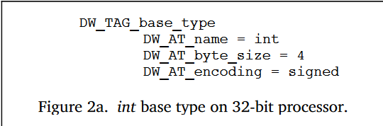
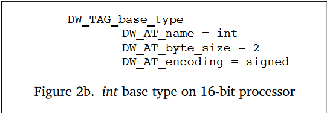
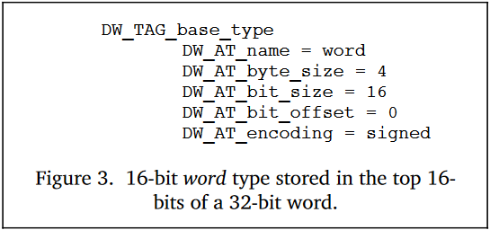

# Describing Data and Types

## Base Types
- Primary Types are built directly on the hardware --> base types
- low level mapping between simple data types and hardware implemetation
- Diff implemetation for diff hardware 

  

  
- `DW_TAG` -> Tags
- `DW_AT` -> Attributes
- Eg : [[die.md]] of 16 bit integer stored in the upper 16 bits of a 4byte word

  

  - `DW_AT_bit_size` -> value is 16bit wide
  - `DW_AT_bit_offset` -> offset from the higher order bit

