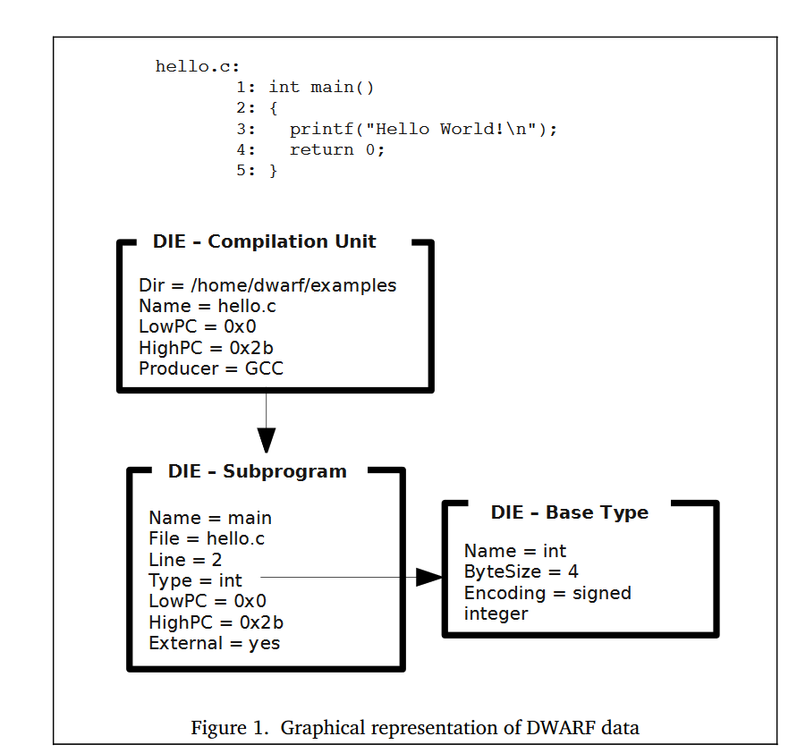

# Die

- **D**ebugging **I**nformation **E**ntry
- Building Blocks of [[dwarf]]
- consists of `tags` and `attributes` which describe the entity
- Tree like structure
- `attributes` can be 
  - constants(fn names)
  - variable (start addr for fn)
  - reference to other Die
  - ...
- Graphical representaion of a DIE
  
  - Topmost => compilation unit 
    - `main` => child of topmost
    - `int` value returned by main :
      - referenced by `main`

## Die in Detail

  1. [[describing-data-types]]
   
  2. [[Describing Executable Code]] 

[//begin]: # "Autogenerated link references for markdown compatibility"
[dwarf]: dwarf "Dwarf Debugging Format"
[describing-data-types]: describing-data-types "Describing Data and Types"
[//end]: # "Autogenerated link references"