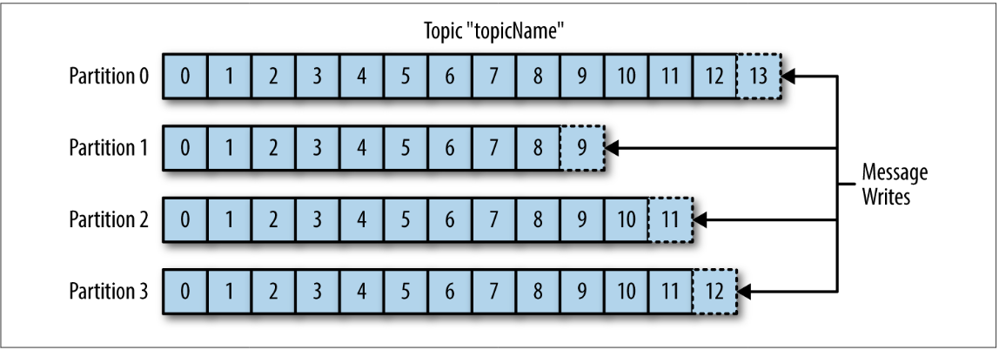
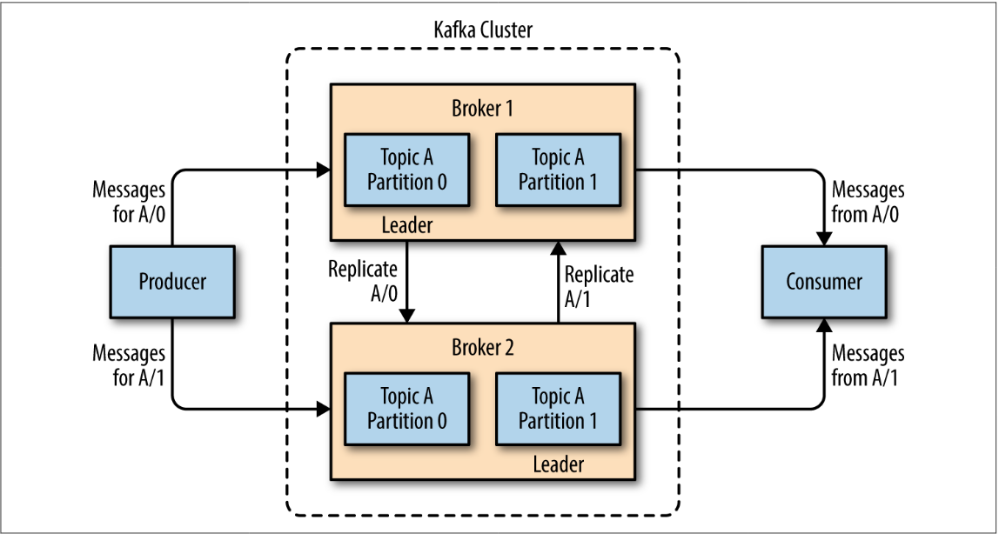

# Apache Kafka

- pub-sub messaging system
- basic unit --> message =>`{ Body :[u8], Key:[u8]}`
- writes are mainly batch operations => `Vec<Messages>`
- Schema --> governs structure of message
  - eg JSON/XML/[Apache Avro](https://avro.apache.org/docs/current/)
- Topics --> collection of messages "about something same"
- Topics made of n partitions => Append only queue-like

  

- Stream => Single topic of data irrespective of partitions
- [[Producer]]
  - produce message for a topic, can sometimes specify which partition to store
- Consumer -> Reads message
  - Subscribes 1:n topics
  - FIFO Read (Queue like)
  - track of consumed messages via offset
  - **Ownership** mapping of consumer to partitions
- Consumer Group -> 1 or more consumers that work together to consumer a topic

  

- Kafka Broker -> Single Kafka server
  - Receives messages from Producers
  - Assign offset
  - Commit to disk
- Kafka Cluster

  - Collection of brokers
  - **1** automatically elected broker will function as the cluster **controller**
  - Controller responsibilities
    - administrative operations
    - assigning partitions to broker
    - monitor for broker failures

  

- Retention -> Configurable for a period of time or size of topic (GB/MB)
- Kafka : Pitch

  - Multiple Producers x Multiple Topics
  - Multiple Consumers
  - Disk Based Retention --> No data loss
  - Scalable
  - High Performance

## Starting Kafka on OSX

```shell
# Start ZooKeeper
# `zkServer` DOESNT WORK IN TMUX!!!
zookeeper-server-start /usr/local/etc/kafka/zookeeper.properties & kafka-server-start /usr/local/etc/kafka/server.properties

# Start kafka server
kafka-server-start.sh /usr/local/etc/kafka/server.properties

# Create a topic
kafka-topics --create --zookeeper localhost:2181 --replication-factor 1 --partitions 1 --topic temptopic

# Start a producer to temptopic
kafka-console-producer --broker-list localhost:9092 --topic temptopic

# In another tab start a consumer to temptopic
kafka-console-producer --broker-list localhost:9092 --topic temptopic --from-beginning
```

[//begin]: # "Autogenerated link references for markdown compatibility"
[Producer]: producer "Producer"
[//end]: # "Autogenerated link references"
