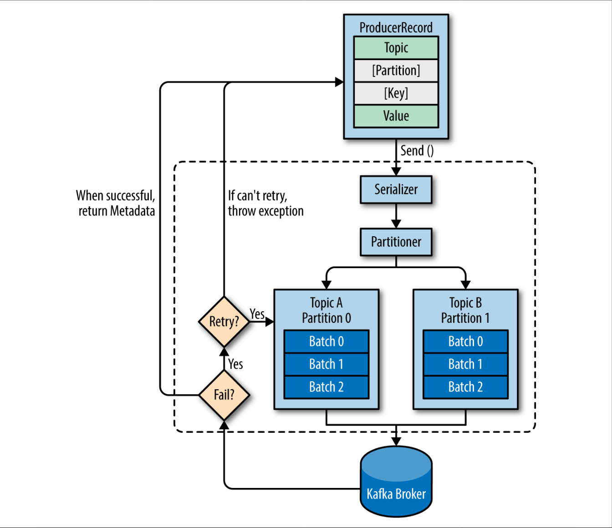
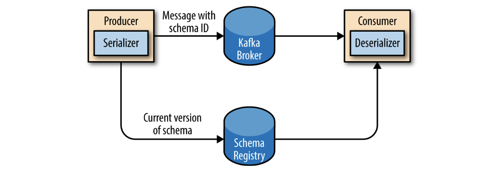

# Producer

Kafka has a binary wire protocol.This means that it is possible for applications to read messages from Kafka or write messages to Kafka simply by sending the correct byte sequences to Kafka’s network port.

Key Structure is `ProducerRecord`



# Serializer

Converts between wire format and code

[Apache Avro](https://https://avro.apache.org/docs/current)
Define a common schema for serialization and deserialization
Store in schema Registry
Store schema identifier in produced message


# Creating a Producer

## In [[rust]]

Crate : [kafka](https://crates.io/crates/kafka)

```rust
/// Producer Code
use std::fmt::Write;
use std::time::Duration;
use kafka::producer::{Producer, Record, RequiredAcks};

let mut producer = Producer::from_hosts(vec!("localhost:9092".to_owned()))
.with_ack_timeout(Duration::from_secs(1))
.with_required_acks(RequiredAcks::One)
.create()
.unwrap();

let mut buf = String::with*capacity(2);
for i in 0..10 {
let * = write!(&mut buf, "{}", i); // some computation of the message data to be sent
producer.send(&Record::from_value("my-topic", buf.as_bytes())).unwrap();
buf.clear();
}
```

Crate : [rdkafka](https://crates.io/crates/rdkafka)

```Rust
 sync fn produce(brokers: &str, topic_name: &str) {
    let producer: &FutureProducer = &ClientConfig::new()
        .set("bootstrap.servers", brokers)
        .set("message.timeout.ms", "5000")
        .create()
        .expect("Producer creation error");

    // This loop is non blocking: all messages will be sent one after the other, without waiting
    // for the results.
    let futures = (0..5)
        .map(|i| async move {
            // The send operation on the topic returns a future, which will be
            // completed once the result or failure from Kafka is received.
            let delivery_status = producer
                .send(
                    FutureRecord::to(topic_name)
                        .payload(&format!("Message {}", i))
                        .key(&format!("Key {}", i))
                        .headers(OwnedHeaders::new().add("header_key", "header_value")),
                    Duration::from_secs(0),
                )
                .await;

            // This will be executed when the result is received.
            info!("Delivery status for message {} received", i);
            delivery_status
        })
        .collect::<Vec<_>>();

    // This loop will wait until all delivery statuses have been received.
    for future in futures {
        info!("Future completed. Result: {:?}", future.await);
    }
}

```

Schema Registry for confluent : https://github.com/gklijs/schema_registry_converter

Confluent Write up : https://www.confluent.io/blog/getting-started-with-rust-and-kafka/

---

## In [[golang]]

Package : [Confluent Inc](https://github.com/confluentinc/confluent-kafka-go)

```golang
func main() {

	p, err := kafka.NewProducer(&kafka.ConfigMap{"bootstrap.servers": "localhost"})
	if err != nil {
		panic(err)
	}

	defer p.Close()

	// Delivery report handler for produced messages
	go func() {
		for e := range p.Events() {
			switch ev := e.(type) {
			case *kafka.Message:
				if ev.TopicPartition.Error != nil {
					fmt.Printf("Delivery failed: %v\n", ev.TopicPartition)
				} else {
					fmt.Printf("Delivered message to %v\n", ev.TopicPartition)
				}
			}
		}
	}()

	// Produce messages to topic (asynchronously)
	topic := "myTopic"
	for _, word := range []string{"Welcome", "to", "the", "Confluent", "Kafka", "Golang", "client"} {
		p.Produce(&kafka.Message{
			TopicPartition: kafka.TopicPartition{Topic: &topic, Partition: kafka.PartitionAny},
			Value:          []byte(word),
		}, nil)
	}

	// Wait for message deliveries before shutting down
	p.Flush(15 * 1000)
}
```

Package : [SegmentIO](https://github.com/segmentio/kafka-go)

```golang
func producer() {

    topic := "my-topic"
    partition := 0

    conn, _ := kafka.DialLeader(context.Background(), "tcp", "localhost:9092", topic, partition)

    conn.SetWriteDeadline(time.Now().Add(10*time.Second))
    conn.WriteMessages(
    kafka.Message{Value: []byte("one!")},
    kafka.Message{Value: []byte("two!")},
    kafka.Message{Value: []byte("three!")},
    )

    conn.Close()
}
```

Package : [Sarama](https://github.com/Shopify/sarama)

```golang
//Sync Producer
func newDataCollector(brokerList []string) sarama.SyncProducer {

	// For the data collector, we are looking for strong consistency semantics.
	// Because we don't change the flush settings, sarama will try to produce messages
	// as fast as possible to keep latency low.
	config := sarama.NewConfig()
	config.Producer.RequiredAcks = sarama.WaitForAll // Wait for all in-sync replicas to ack the message
	config.Producer.Retry.Max = 10                   // Retry up to 10 times to produce the message
	config.Producer.Return.Successes = true
	tlsConfig := createTlsConfiguration()
	if tlsConfig != nil {
		config.Net.TLS.Config = tlsConfig
		config.Net.TLS.Enable = true
	}

	// On the broker side, you may want to change the following settings to get
	// stronger consistency guarantees:
	// - For your broker, set `unclean.leader.election.enable` to false
	// - For the topic, you could increase `min.insync.replicas`.

	producer, err := sarama.NewSyncProducer(brokerList, config)
	if err != nil {
		log.Fatalln("Failed to start Sarama producer:", err)
	}

	return producer
}

// Async Producer
func newAccessLogProducer(brokerList []string) sarama.AsyncProducer {

	// For the access log, we are looking for AP semantics, with high throughput.
	// By creating batches of compressed messages, we reduce network I/O at a cost of more latency.
	config := sarama.NewConfig()
	tlsConfig := createTlsConfiguration()
	if tlsConfig != nil {
		config.Net.TLS.Enable = true
		config.Net.TLS.Config = tlsConfig
	}
	config.Producer.RequiredAcks = sarama.WaitForLocal       // Only wait for the leader to ack
	config.Producer.Compression = sarama.CompressionSnappy   // Compress messages
	config.Producer.Flush.Frequency = 500 * time.Millisecond // Flush batches every 500ms

	producer, err := sarama.NewAsyncProducer(brokerList, config)
	if err != nil {
		log.Fatalln("Failed to start Sarama producer:", err)
	}

	// We will just log to STDOUT if we're not able to produce messages.
	// Note: messages will only be returned here after all retry attempts are exhausted.
	go func() {
		for err := range producer.Errors() {
			log.Println("Failed to write access log entry:", err)
		}
	}()

	return producer
}

go func sendMessage(){
        // Synch
		partition, offset, err := s.DataCollector.SendMessage(&sarama.ProducerMessage{
			Topic: "important",
			Value: sarama.StringEncoder(r.URL.RawQuery),
        })
        // Async
        s.AccessLogProducer.Input() <- &sarama.ProducerMessage{
			Topic: "access_log",
			Key:   sarama.StringEncoder(r.RemoteAddr),
			Value: entry,
		}
}
```

[//begin]: # "Autogenerated link references for markdown compatibility"
[rust]: rust "Rust"
[golang]: golang "Golang"
[//end]: # "Autogenerated link references"
